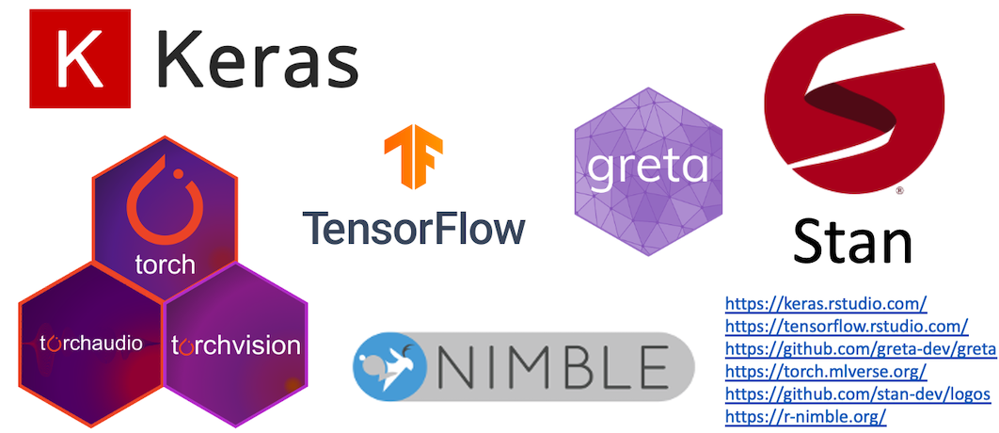
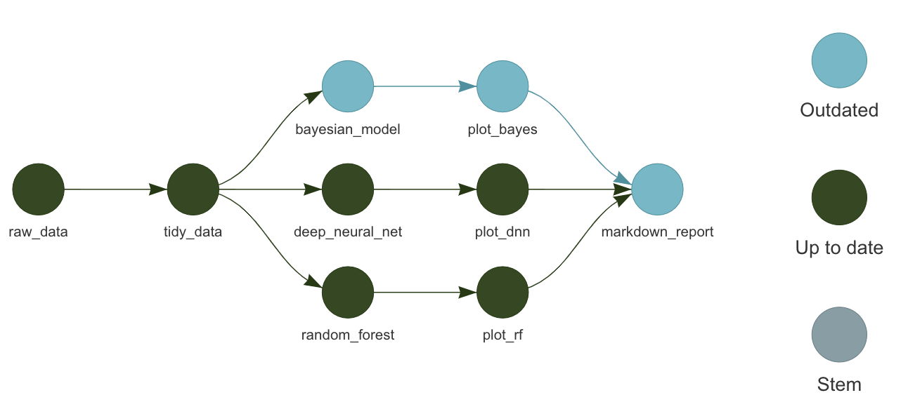

<style>
.inverse {
background-color: transparent;
text-shadow: 0 0 0px transparent;
}
.title-slide {
vertical-align: bottom !important; 
text-align: center !important;
}
.title-slide h1 {
position: absolute;
top: 0;
left: 0;
right: 0;
width: 100%;
line-height: 4em;
color: #666666;
}
.title-slide h3 {
line-height: 6em;
color: #666666;
}
.title-slide {
background-color: white;
background-image: url('images/logo.png');
background-repeat: no-repeat;
background-size: 25%;
}
.remark-slide-content:after {
content: "Copyright Eli Lilly and Company";
position: absolute;
bottom: -5px;
left: 10px;
height: 40px;
width: 100%;
font-family: Helvetica, Arial, sans-serif;
font-size: 0.7em;
color: gray;
background-repeat: no-repeat;
background-size: contain;
}
.remark-slide-content .nocopyright:after {
content: "";
}
</style>

```{r, include = FALSE}
knitr::opts_chunk$set(
  collapse = TRUE,
  warning = FALSE,
  comment = "#>",
  fig.align = "center",
  fig.width = 10,
  fig.height = 7,
  out.width = "80%",
  out.height = "80%"
)
```

```{r, include = FALSE, message = FALSE}
options(
  warnPartialMatchArgs = FALSE,
  drake_clean_menu = FALSE,
  drake_make_menu = FALSE,
  htmltools.dir.version = FALSE
)
packages <- c(
  "targets",
  "keras",
  "recipes",
  "rsample",
  "tidyverse",
  "yardstick"
)
purrr::walk(
  packages,
  function(pkg) {
    suppressMessages(suppressWarnings(library(pkg, character.only = TRUE)))
  }
)
Sys.setenv(TAR_SCRIPT_ASK = "false")
tar_destroy()
```

## Demanding computation in R



.pull-left[
* Deep learning: `keras`, `tensorflow`, `torch`
* Machine learning: `tidymodels`
* Bayesian data analysis: JAGS, Stan, NIMBLE, `greta`
* PK/PD: `nlmixr`, `mrgsolve`
]

.pull-right[
* Clinical trial simulation: `rpact`, `Mediana`
* Statistical genomics
* Social network analysis
* Permutation tests
* Database queries: `DBI`
* ETL on large data
]

---

## Overlooked realities of long computation


---

## Workflows have interconnected steps.


---

## If you change code or data...


---

## ...the downstream steps are no longer valid.


---

## Dilemma: short runtimes or reproducible results?


---

## Let a pipeline tool figure out what to run.



* Saves time while ensuring computational reproducibility.

---

## Pipeline tools


* Existing pipeline tools: https://github.com/pditommaso/awesome-pipeline
* Most are language-agnostic or designed for Python or the shell.

---

## `targets` 

<center>

</center>

* Fundamentally designed for R.
* Supports a clean, modular, function-oriented programming style.
* Abstracts files as R objects and automatically manages data.
* Surpasses the permanent limitations of its predecessor, [`drake`](https://github.com/ropensci/drake): <https://books.ropensci.org/targets/drake.html>.
* Continuation of the ideas from `remake` by Rich FitzJohn: <https://github.com/richfitz/remake>.

---

## `targets` embraces functions.

> * Everything that exists is an object.
> * Everything that happens is a function call.
>
> John Chambers

* Functions are fundamental building blocks in most computer languages.
* Advantages of functions:
    * Clearly define relationships among inputs and outputs.
    * Help `targets` decide which tasks to run and which ones to skip.
    * Break down complicated ideas into manageable pieces.
    * Custom shorthand to make code easier to read.
* Common uses of R functions in data science:
    1. Preprocess a dataset.
    2. Analyze a dataset.
    3. Summarize an analysis.

---

## Example: customer churn

* Deep learning with Keras.
* IBM Cognos Analytics Telco customer churn dataset.
* Find the model that best predicts which customers will cancel their telecom subscriptions.
* Example comes from Matt Dancho's 2018 RStudio AI Blog post: https://blogs.rstudio.com/ai/posts/2018-01-11-keras-customer-churn/.

