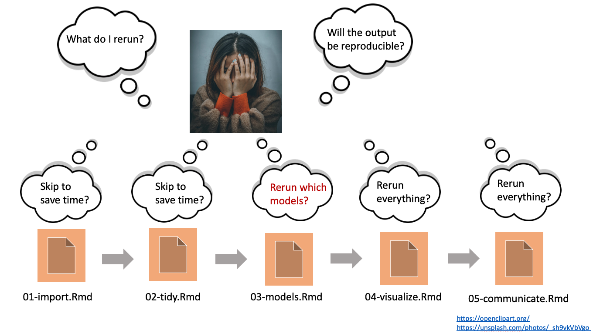

<style>
.inverse {
background-color: transparent;
text-shadow: 0 0 0px transparent;
}
.title-slide {
vertical-align: bottom !important; 
text-align: center !important;
}
.title-slide h1 {
position: absolute;
top: 0;
left: 0;
right: 0;
width: 100%;
line-height: 4em;
color: #666666;
}
.title-slide h3 {
line-height: 6em;
color: #666666;
}
.title-slide {
background-color: white;
background-image: url('images/logo.png');
background-repeat: no-repeat;
background-size: 25%;
}
.remark-slide-content:after {
content: "Copyright Eli Lilly and Company";
position: absolute;
bottom: -5px;
left: 10px;
height: 40px;
width: 100%;
font-family: Helvetica, Arial, sans-serif;
font-size: 0.7em;
color: gray;
background-repeat: no-repeat;
background-size: contain;
}
.remark-slide-content .nocopyright:after {
content: "";
}
.small {
  font-size: 85%;
}
</style>

```{r, include = FALSE}
knitr::opts_chunk$set(
  collapse = TRUE,
  warning = FALSE,
  comment = "#>",
  fig.align = "center",
  fig.width = 10,
  fig.height = 7,
  out.width = "80%",
  out.height = "80%"
)
```

```{r, include = FALSE, message = FALSE}
options(
  warnPartialMatchArgs = FALSE,
  drake_clean_menu = FALSE,
  drake_make_menu = FALSE,
  htmltools.dir.version = FALSE
)
packages <- c(
  "targets",
  "keras",
  "recipes",
  "rsample",
  "tidyverse",
  "yardstick"
)
purrr::walk(
  packages,
  function(pkg) {
    suppressMessages(suppressWarnings(library(pkg, character.only = TRUE)))
  }
)
Sys.setenv(TAR_SCRIPT_ASK = "false")
tar_destroy()
```

## Demanding computation in R

* Deep learning: `keras`, `tensorflow`, `torch`
* Machine learning: `tidymodels`
* Bayesian data analysis: JAGS, Stan, NIMBLE, `greta`
* PK/PD: `nlmixr`, `mrgsolve`
* Clinical trial simulation: `rpact`, `Mediana`
* Statistical genomics
* Social network analysis
* Permutation tests
* Database queries: `DBI`
* ETL on large data

---

## Overlooked realities of long computation


---

## Workflows have interconnected steps.


---

## If you change code or data...


---

## ...the downstream steps are no longer valid.


---

## Dilemma: short runtimes or reproducible results?



---

## Let a pipeline tool figure out what to rerun.


* Save time while ensuring computational reproducibility.
* Automatic parallel/distributed computing based on the directed acyclic graph.

---

## Pipeline tools

<center>

</center>

* Existing pipeline tools: https://github.com/pditommaso/awesome-pipeline
* Most are language-agnostic or designed for Python or the shell.

## {targets}

* Fundamentally designed for R.
* Supports a clean, modular, function-oriented programming style.
* Abstracts files as R objects and automatically manages data.
* Surpasses the permanent limitations of its predecessor, [`drake`](https://github.com/ropensci/drake): <https://books.ropensci.org/targets/drake.html>.
* Continuation of the ideas from `remake` by Rich FitzJohn: <https://github.com/richfitz/remake>.

---

## {targets} embraces functions.

> Nearly everything that happens in R results from a function call. Therefore, basic programming centers on creating and refining functions.
>
> [John Chambers (2008)](https://www.springer.com/gp/book/9780387759357)

* Functions are fundamental building blocks in most computer languages.
* Advantages of functions:
    * Clearly define relationships among inputs and outputs.
    * Help `targets` decide which tasks to run and which ones to skip.
    * Break down complicated ideas into manageable pieces.
    * Custom shorthand to make code easier to read.
* Common uses of R functions in data science:
    1. Preprocess a dataset.
    2. Analyze a dataset.
    3. Summarize an analysis.

---

## Example: customer churn

* Deep learning with Keras.
* IBM Cognos Analytics Telco customer churn dataset.
* Find the model that best predicts which customers will cancel their telecom subscriptions.
* Example comes from Matt Dancho's 2018 RStudio AI Blog post: https://blogs.rstudio.com/ai/posts/2018-01-11-keras-customer-churn/.

---

## Project files

* Many variations on this theme, only `_targets.R` is strictly required.

```{r, eval = FALSE}
_targets.R
R/
└── functions.R
data/
└── customer_churn.csv
```

---

## functions.R file

```{r, eval = FALSE}
split_data <- function(file) {
  read_csv(file, col_types = cols()) %>%
    initial_split(prop = 0.7)
}

prepare_recipe <- function(data) {
  # ...
}

test_model <- function(data, recipe, act1) {
  # ...
}
```

---

## _targets.R file

```{r, eval = FALSE}
library(targets)
source("R/functions.R")
tar_option_set(packages = c("keras", "tidyverse", "rsample", "recipes", "yardstick"))
list(
  tar_target(file, "data/churn.csv", format = "file"),
  tar_target(data, split_data(file)),
  tar_target(recipe, prepare_recipe(data)),
  tar_target(model1, test_model(data, recipe, act1 = "relu")),
  tar_target(model2, test_model(data, recipe, act1 = "sigmoid")),
  tar_target(model3, test_model(data, recipe, act1 = "linear"))
)
```

---

## Check the graph.

```{r, eval = FALSE}
tar_visnetwork(targets_only = TRUE)
```


---

## Run the pipeline.

```{r, eval = FALSE}
tar_make()
#> • start target file
#> • built target file
#> • start target data
#> • built target data
#> • start target recipe
#> • built target recipe
#> • start target model1
#> • built target model1
#> • start target model2
#> • built target model2
#> • start target model3
#> • built target model3
#> • end pipeline
```

---

## Check the results.

```{r, eval = FALSE}
tar_read(model1)
#> # A tibble: 1 x 2
#>   accuracy act1 
#>      <dbl> <chr>
#> 1    0.794 relu 
tar_read(model3)
#> # A tibble: 1 x 2
#>   accuracy act1  
#>      <dbl> <chr> 
#> 1    0.798 linear
```

---

## Change a target.

```{r, eval = FALSE}
library(targets)
source("R/functions.R")
tar_option_set(packages = c("keras", "tidyverse", "rsample", "recipes", "yardstick"))
list(
  tar_target(file, "data/churn.csv", format = "file"),
  tar_target(data, split_data(file)),
  tar_target(recipe, prepare_recipe(data)),
  tar_target(model1, test_model(data, recipe, act1 = "relu")),
  tar_target(model2, test_model(data, recipe, act1 = "sigmoid")),
  tar_target(model3, test_model(data, recipe, act1 = "softmax")) #<<
)
```

---

## Only model3 will rerun next time.

```{r, eval = FALSE}
tar_visnetwork(targets_only = TRUE)
```


---

## The other models are skipped to save time.

```{r, eval = FALSE}
tar_make()
#> ✓ skip target file
#> ✓ skip target data
#> ✓ skip target recipe
#> ✓ skip target model1
#> ✓ skip target model2
#> • start target model3
#> • built target model3
#> • end pipeline
```

---

## Change function code.

```{r, eval = FALSE}
define_model <- function(churn_recipe, act1) {
  input_shape <- ncol(
    juice(churn_recipe, all_predictors(), composition = "matrix")
  )
  out <- keras_model_sequential() %>%
    layer_dense(
      units = units1,
      kernel_initializer = "uniform",
      activation = act1,
      input_shape = input_shape
    ) %>%
    layer_dropout(rate = 0.2) # previously 0.1 #<<
  # ...
}
```

---

## {targets} understand dependencies among functions.

```{r, eval = FALSE}
tar_visnetwork(targets_only = FALSE)
```

<image src="./images/keras-function.png" height = "400px">

---

## Run the models but skip the data.

```{r, eval = FALSE}
tar_make()
#> ✓ skip target file
#> ✓ skip target data
#> ✓ skip target recipe
#> • start target model1
#> • built target model1
#> • start target model2
#> • built target model2
#> • start target model3
#> • built target model3
#> • end pipeline
```

---

## Tangible evidence of reproducibility

```{r, eval = FALSE}
tar_make()
#> ✓ skip target file
#> ✓ skip target data
#> ✓ skip target recipe
#> ✓ skip target model1
#> ✓ skip target model2
#> ✓ skip target model3
#> ✓ skip pipeline
```

---

## Extending {targets}


---

## Target factories

* A target factory is a reusable function that creates target objects.

```{r, eval = FALSE}
target_factory <- function(file) {
  list(
    tar_target_raw("file", file, format = "file", deployment = "main"),
    tar_target_raw("data", quote(read_data(file)), format = "fst_tbl", deployment = "main"),
    tar_target_raw("model", quote(run_model(data)), format = "qs")
  )
}
```

---

## Target factories simplify pipeline construction.

```{r, eval = FALSE}
# _targets.R
library(targets)
library(yourExamplePackage)
list(
  target_factory("data.csv")
)
```

```{r, eval = FALSE}
# R console
tar_manifest(fields = command)
#> # A tibble: 3 x 2
#>   name  command          
#>   <chr> <chr>            
#> 1 file  "\"data.csv\""   
#> 2 data  "read_data(file)"           
#> 3 model "run_model(data)"
```

---

## Example: {stantargets}

<center>
<image src="./images/stantargets.png" height = "300px">
</center>

* Easy pipeline construction for Stan statistical models.
* Uses R packages [`cmdstanr`](https://mc-stan.org/cmdstanr/) and [`posterior`](https://mc-stan.org/posterior/).

---

## About Stan

* Probabilistic programming language ([Carpenter et al. 2017](https://www.jstatsoft.org/article/view/v076i01)).
* Markov chain Monte Carlo (MCMC) with HMC and NUTS.
    * Often more efficient than Gibbs sampling.
    * Flexible specification of posterior distributions.
    * Indifferent to conjugacy.
* Variational inference (ADVI)
* Penalized MLE (L-BFGS)

---

## Example Stan model

```{c, eval = FALSE}
// model.stan
data {
  int <lower = 1> n;
  vector[n] x;
  vector[n] y;
}
parameters {
  real alpha;
  vector[n] beta;
}
model {
  y ~ normal(alpha + x .* beta, 1);
  alpha ~ normal(0, 1);
  beta ~ normal(0, 1);
}
```

---

## Interval-based validation study

* For thousands of independent replications:
    * Simulate data from the prior predictive distribution.
    * Fit the model to the simulated data using MCMC.
    * Calculate x% posterior intervals for each of `alpha` and `beta`.
* For each of `alpha` and `beta`, roughly x% of the posterior intervals should cover the corresponding parameter draws from the joint prior.
* Simulation-based calibration extends this idea further ([Cook et al. 2006](https://www.jstor.org/stable/27594203); [Talts et al. 2020](https://arxiv.org/abs/1804.06788)).

---

## Function for prior predictive simulations

```{r, eval = FALSE}
simulate_data <- function(n = 10L) {
  alpha <- rnorm(n = 1, mean = 0, sd = 1)
  beta <- rnorm(n = n, mean = 0, sd = 1)
  x <- seq(from = -1, to = 1, length.out = n)
  y <- rnorm(n, alpha + x * beta, 1)
  list(
    n = n,
    x = x,
    y = y,
    # Hold on to prior draws:
    .join_data = list(alpha = alpha, beta = beta) #<<
  )
}
```

---

## _targets.R file

```{r, eval = FALSE}
library(targets)
library(stantargets)
source("R/functions.R")
tar_option_set(packages = "tidyverse")
options(clustermq.scheduler = "multicore") #<<
list(
  tar_stan_mcmc_rep_summary(
    name = model, stan_files = "model.stan", data = simulate_data(),
    batches = 80, reps = 25, variables = c("alpha", "beta"),
    summaries = list(
      ~posterior::quantile2(.x, probs = c(0.025, 0.975)),
      rhat = posterior::rhat
    ),
  ),
  tar_target(
    coverage,
    model %>%
      group_by(variable) %>%
      summarize(rate = mean(q2.5 < .join_data & .join_data < q97.5))
  )
)
```

---

## Multiple targets


---

## Run MCMC batches in parallel

```{r, eval = FALSE}
> tar_make_clustermq(workers = 4) # 4 local cores
#> • start target model_batch
#> • built target model_batch
#> • start branch model_data_b0b9380a
#> • start branch model_data_ffcdb73c
#> • start branch model_data_b968a03a
#> • start branch model_data_f8763cb2
#> • built branch model_data_ffcdb73c
#> • start branch model_data_0bfdabdc
#> • built branch model_data_f8763cb2
#> • start branch model_data_d888319c
#> ...
```

* High-performance computing with `targets`: <https://books.ropensci.org/targets/hpc.html>
* Distributed computing available, not just multicore: SLURM, SGE, TORQUE, PBS, LSF 
* Persistent workers with the [`clustermq`](https://mschubert.github.io/clustermq/) package: `tar_make_clustermq()`
* Transient workers with the [`future`](https://future.futureverse.org/) package: `tar_make_future()`

---

## Simulation results

```{r, eval = FALSE}
tar_read(model)
#> # A tibble: 22,000 x 8
#>    variable   q2.5 q97.5  rhat .join_data .rep     .file      .name
#>    <chr>     <dbl> <dbl> <dbl>      <dbl> <chr>    <chr>      <chr>
#>  1 alpha     0.575  1.92  1.00      0.768 14556f0a model.stan model
#>  2 beta[1]  -1.34   1.50  1.00      0.163 14556f0a model.stan model
#>  3 beta[2]  -0.620  2.51  1.00      1.14  14556f0a model.stan model
#>  4 beta[3]  -1.81   1.67  1.00      1.03  14556f0a model.stan model
#>  5 beta[4]  -2.22   1.51  1.00      0.638 14556f0a model.stan model
#>  6 beta[5]  -1.97   1.99  1.00     -1.03  14556f0a model.stan model
#>  7 beta[6]  -1.99   1.90  1.00     -0.348 14556f0a model.stan model
#>  8 beta[7]  -1.28   2.52  1.00     -0.570 14556f0a model.stan model
#>  9 beta[8]  -1.80   1.63  1.00      0.832 14556f0a model.stan model
#> 10 beta[9]  -1.84   1.33  1.00      0.551 14556f0a model.stan model
# … with 21,990 more rows
```

---

## Coverage is nominal (95%)

```{r, eval = FALSE}
tar_read(coverage)
#> # A tibble: 11 x 2
#>    variable  rate
#>    <chr>    <dbl>
#>  1 alpha    0.950
#>  2 beta[1]  0.948
#>  3 beta[10] 0.959
#>  4 beta[2]  0.954
#>  5 beta[3]  0.962
#>  6 beta[4]  0.949
#>  7 beta[5]  0.952
#>  8 beta[6]  0.960
#>  9 beta[7]  0.952
#> 10 beta[8]  0.952
#> 11 beta[9]  0.944
```

---

## Resources

* `targets`: <https://docs.ropensci.org/targets/>
* `stantargets`:  <https://docs.ropensci.org/stantargets/>
* Stan: <https://mc-stan.org/>

## References

.small[
* Bob Carpenter, Andrew Gelman, Matthew D. Hoffman, Daniel Lee, Ben Goodrich, Michael Betancourt, Marcus Brubaker, Jiqiang Guo, Peter Li, and Allen Riddell. 2017. Stan: A probabilistic programming language. Journal of Statistical Software 76(1). [10.18637/jss.v076.i01](https://www.jstatsoft.org/article/view/v076i01).
* Samantha R. Cook, Andrew Gelman, and Donald B. Rubin. 2006. "Validation of Software for Bayesian Models Using Posterior Quantiles." Journal of Computational and Graphical Statistics 15 (3): 675–92. <http://www.jstor.org/stable/27594203>.
* John M. Chambers. 2008. <u>Software for Data Analysis: Programming with R</u>. Chapter 3. Springer, 978-1441926128, <https://www.springer.com/gp/book/9780387759357>.
* Matt Dancho. "Deep Learning With Keras To Predict Customer Churn." RStudio AI Blog, 2018-01-11. <https://blogs.rstudio.com/tensorflow/posts/2018-01-11-keras-customer-churn/>.
* Sean Talts, Michael Betancourt, Daniel Simpson, Aki Vehtari, and Andrew Gelman. 2020. "Validating Bayesian Inference Algorithms with Simulation-Based Calibration." <http://arxiv.org/abs/1804.06788>.
]
